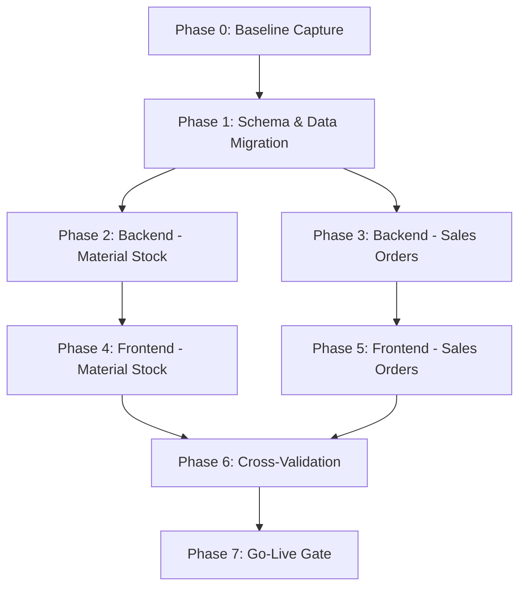

# SAP ABAP to Java/Angular Migration Plan

## Overview

This document describes the 8-phase migration plan for converting the SAP ABAP material stock and sales order reporting system to a modern Java (Spring Boot) + Angular stack.

### Source ABAP Programs
| ABAP Source | Description | Target |
|---|---|---|
| ZMAT_REPORT.PROG | Material stock report with ALV grid | MaterialStockController + MaterialStockComponent |
| ZFM_GET_MAT_SO_DETAILS..FUGR.txt | Sales order function module | SalesOrderController + SalesOrderComponent |
| LZFG_MAT_SOTOP.txt | Function group TOP include (types) | Entity & DTO classes |

### Technology Stack
| Layer | SAP (Source) | Java/Angular (Target) |
|---|---|---|
| Backend Runtime | ABAP Application Server | Spring Boot 3.2.x on JVM 17 |
| Database | SAP HANA / Oracle (via Open SQL) | PostgreSQL 15+ via JPA/Hibernate |
| Schema Management | SAP Data Dictionary (SE11) | Flyway migrations |
| REST API | RFC / BAPI | Spring MVC @RestController |
| Frontend Framework | SAP GUI / ALV (CL_SALV_TABLE) | Angular 17 + AG Grid |
| Testing | ABAP Unit (limited) | JUnit 5 + Mockito + Cypress |

## Phase Dependency Diagram

## Phase Details

### Phase 0: Baseline Capture
**Objective:** Record current SAP system behavior as the "source of truth."

**Activities:**
1. Execute ZMAT_REPORT in SAP GUI with standard selection parameters
2. Record OBS video of full execution flow
3. Export ALV grid data to CSV
4. Execute ZFM_GET_MAT_SO_DETAILS via SE37 with test materials
5. Screenshot all function module outputs
6. Export Postman/RFC test results

**Artifacts:**
- `test-artifacts/phase0-baseline/videos/` — OBS recordings
- `test-artifacts/phase0-baseline/screenshots/` — SAP GUI screenshots
- `test-artifacts/phase0-baseline/csv-exports/` — ALV CSV exports

**Go/No-Go Gate:** All baseline artifacts captured and archived.

---

### Phase 1: Schema & Data Migration
**Objective:** Create PostgreSQL equivalents of SAP tables and seed test data.

**Activities:**
1. Create Flyway V1 migration: `material`, `material_text`, `material_stock`, `sales_order_header`, `sales_order_item`
2. Create Flyway V2 migration: seed data covering scenarios SD-1 through SD-7
3. Validate schema against SAP Data Dictionary definitions (MARA, MAKT, MARD, VBAK, VBAP)

**SAP Table Mapping:**
| SAP Table | PostgreSQL Table | Key Fields |
|---|---|---|
| MARA | material | matnr (PK), mtart, meins |
| MAKT | material_text | matnr + spras (composite PK), maktx |
| MARD | material_stock | matnr + werks + lgort (composite PK), labst |
| VBAK | sales_order_header | vbeln (PK), auart, vkorg, vtweg, spart, erdat, ernam |
| VBAP | sales_order_item | vbeln + posnr (composite PK), matnr, kwmeng, vrkme, pstyv |

**Test Data Scenarios:**
| ID | Scenario | Purpose |
|---|---|---|
| SD-1 | Material with stock in multiple plants | Test byPlant grouping |
| SD-2 | Material with zero stock | Test zero-value handling |
| SD-3 | Material with no MAKT entry for language E | Test null maktx |
| SD-4 | Material with MAKT in both E and D | Test language filtering |
| SD-5 | Material with 3+ sales orders | Test multi-order retrieval |
| SD-6 | Material with no sales orders | Test empty result + message |
| SD-7 | Material 123 (short number) | Test ALPHA conversion → 000000000000000123 |

**Go/No-Go Gate:** All tables created, seed data loaded, schema validated.

---

### Phase 2: Backend — Material Stock Service
**Objective:** Replicate ZMAT_REPORT.PROG fetch_data logic (lines 59-172) in Java.

**Activities:**
1. Create entity classes (Material, MaterialText, MaterialStock) with JPA annotations
2. Create MaterialStockRepository with 4 native query methods matching the 4 SQL branches
3. Create MaterialStockService with sorting and top-N logic
4. Create MaterialStockController with GET /api/materials/stock endpoint
5. Write unit tests (P2-UT01 through P2-UT11) with Mockito
6. Write integration tests (P2-IT01 through P2-IT07) with H2

**ABAP → Java Logic Mapping:**
| ABAP Code (ZMAT_REPORT.PROG) | Java Equivalent |
|---|---|
| Lines 69-83: SELECT with GROUP BY incl. werks | findByPlantAllPlants() |
| Lines 84-100: SELECT with GROUP BY + werks filter | findByPlantSpecific() |
| Lines 114-129: SELECT with GROUP BY excl. werks | findAggregatedAllPlants() |
| Lines 130-145: SELECT with werks filter, no group | findAggregatedSpecificPlant() |
| Lines 154-155: CLEAR gs_out-werks | Set werks=null in DTO |
| Lines 165-167: SORT BY labst DESC, TOP rows | Sort + subList(0, top) |
| Lines 168-169: SORT BY matnr ASC werks ASC | Default sort order |

**Artifacts:**
- `test-artifacts/phase2-backend/junit-reports/` — Maven Surefire reports
- `test-artifacts/phase2-backend/postman/` — API test exports

**Go/No-Go Gate:** All 18 tests pass (11 unit + 7 integration).

---

### Phase 3: Backend — Sales Order Service
**Objective:** Replicate ZFM_GET_MAT_SO_DETAILS logic (lines 30-107) in Java.

**Activities:**
1. Create entity classes (SalesOrderHeader, SalesOrderItem) with JPA annotations
2. Create SalesOrderRepository with native join queries
3. Create SalesOrderService with ALPHA conversion, validation, maxRows handling
4. Create SalesOrderController with GET /api/sales-orders endpoint
5. Write unit tests (P3-UT01 through P3-UT10) with Mockito
6. Write integration tests (P3-IT01 through P3-IT06) with H2

**ABAP → Java Logic Mapping:**
| ABAP Code (FUGR.txt) | Java Equivalent |
|---|---|
| Lines 30-33: IF iv_matnr IS INITIAL | Validate matnr not blank |
| Lines 36-39: CONVERSION_EXIT_MATN1_INPUT | StringUtils.leftPad(matnr, 18, '0') |
| Lines 45-68: SELECT with/without vbeln filter | findByMaterial / findByMaterialAndOrder |
| Lines 70-72: add_message 'No sales orders...' | ApiMessage with type S |
| Lines 94-98: DELETE from lv_max+1 | subList(0, min(maxRows, size)) |
| Lines 104-107: CATCH cx_sy_open_sql_db | DataAccessException handler |

**Go/No-Go Gate:** All 16 tests pass (10 unit + 6 integration).

---

### Phase 4: Frontend — Material Stock Component
**Objective:** Replace ZMAT_REPORT ALV display (lines 175-250) with Angular + AG Grid.

**Activities:**
1. Create MaterialStockComponent with reactive form matching selection screen
2. Create AG Grid with 6 columns matching ALV field catalog
3. Implement striped rows, pinned total row, CSV export
4. Write Cypress E2E tests (P4-E2E01 through P4-E2E12)

**SAP ALV → AG Grid Mapping:**
| ALV Feature (ZMAT_REPORT.PROG) | AG Grid Equivalent |
|---|---|
| CL_SALV_TABLE→factory() | `<ag-grid-angular>` component |
| set_all(abap_true) — sort/filter | defaultColDef: { sortable: true, filter: true } |
| set_optimize — auto width | gridApi.autoSizeAllColumns() |
| set_striped_pattern | CSS .ag-row-even background |
| add_aggregation('LABST') | pinnedBottomRowData with SUM |
| set_list_header | Report header div with date/time |

**Go/No-Go Gate:** All 12 E2E tests pass with screenshots/videos.

---

### Phase 5: Frontend — Sales Order Component
**Objective:** Create Angular UI for sales order queries.

**Activities:**
1. Create SalesOrderComponent with reactive form (matnr required, vbeln optional)
2. Create AG Grid with 14 columns matching ty_out structure
3. Display API messages (replacing BAPIRET2 pattern)
4. Write Cypress E2E tests (P5-E2E01 through P5-E2E06)

**Go/No-Go Gate:** All 6 E2E tests pass with screenshots.

---

### Phase 6: Cross-Validation
**Objective:** Prove that Java REST API produces identical output to SAP system.

**Activities:**
1. Run cross-validate.js script comparing Phase 0 CSV exports with Java API responses
2. Normalize field names (SAP uppercase → Java camelCase)
3. Handle ALPHA conversion differences in material numbers
4. Generate HTML diff report

**Artifacts:**
- `test-artifacts/phase6-xvalidation/diff-reports/` — HTML comparison reports

**Go/No-Go Gate:** Zero functional differences between SAP and Java outputs.

---

### Phase 7: Go-Live Gate
**Objective:** Final sign-off before production deployment.

**Checklist:**
- [ ] All 70 test cases pass
- [ ] Cross-validation shows zero differences
- [ ] Performance benchmarks meet SLA
- [ ] Security review completed
- [ ] Rollback plan documented
- [ ] Stakeholder sign-off obtained

---

## Summary

| Phase | Tests | Type | Status |
|---|---|---|---|
| Phase 0 | N/A | Manual baseline capture | ☐ |
| Phase 1 | Schema validation | Migration scripts | ☐ |
| Phase 2 | P2-UT01–P2-UT11, P2-IT01–P2-IT07 | Unit + Integration | ☐ |
| Phase 3 | P3-UT01–P3-UT10, P3-IT01–P3-IT06 | Unit + Integration | ☐ |
| Phase 4 | P4-E2E01–P4-E2E12 | E2E (Cypress) | ☐ |
| Phase 5 | P5-E2E01–P5-E2E06 | E2E (Cypress) | ☐ |
| Phase 6 | Cross-validation script | Automated comparison | ☐ |
| Phase 7 | Go-live checklist | Manual review | ☐ |
| **Total** | **70 test cases** | | |
